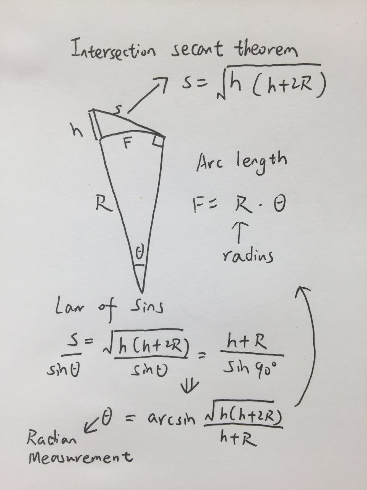

Homework 2 - Curious Cats (Team 3)
========================================================

# `get_lq` code

In order to get the data from the La Quinta website, we first create a directory in which we will store the data files that we download. Then we define the base url of the la quinta website as we will need this base url later in the process to connect it to the links we extract. We start scraping the data by loading the main hotel list that contains links to all hotels. From this website we extract the links to all individual hotel sites through a combination of `rvest` and `stringr` commands.

Once we have the list of links to the hotels, we can download the files through a for loop. Note that it is necessary to add a 5-second delay after each download in order to prevent the website from blocking our requests.


# `parse_lq` code

Once we have downloaded all files related to the La Quinta hotels, we can create a list of those files in our directory. Our goal here is to extract the latitude and longitude to precisely locate the La Quinta hotels in the United States. Additionally, our goal for the statistical analysis is to extract the number of floors. We need the number of floors because we want to analyze, given the shape of the earth, whether it theoretically possible to see a Denny's from the highest floor of a La Quinta hotel.

In order to do this we first create two empty vectors - one for the latitude and longitude and one for the number of floors. Then, through a for loop, we iterate through all files, read them as html, and extract the required pieces of information. Then we split latitude and longitude into separate values and finally turn all values we have into numerical values. Once we have the numerical values we combine them to a data frame and save this data frame as Rdata object.

# `get_dennys` code
This code is dependent on a key, which could expire.  If the code stops working, this is one possible point of failure.  The function `get_dennys_info` is based on the similar function presented in class.  It accepts various inputs that are used to construct a URL.  This URL is then used to retrieve data from the API. 

The centers for the requests are stored in the file `dennys_coords.csv`.  The centers were determined using the mapping tools at http://www.freemaptools.com/radius-around-point.htm, which allows the user to place circles of a given radius (in this case we used 1000 miles) at any point on the globe.  There are five centers correspond to Alaska, Hawaii, the East coast, the West coast, and the Midwest.  Anyone desiring to confirm that these points to in fact cover the whole of the United States (with the exception of some minor Alaskan islands) can do by uploading the coordinates to the website.  

Finally, the `gather_data` function, calls the `get_dennys_info` function repeatedly using the centers and radii proved by the `dennys_coords.csv` file.  The results are stored in files called `1.xml`, `2.xml` and so on and placed in the director `data/dennys`.  The `gather_data` function is itself called in an apply function with `invisible` suppressing the output.  

# `parse_dennys` code
The `parse_dennys` code takes the data files created by `get_dennys` and transforms them into a data frame.  The `dennys_coords.csv` file is needed to determine the number of files (which is equal to number of rows) created by `get_dennys`.  The results are processed using the HTML/XML tools of the package `rvest`.  The pieces of information to be pulled from the XML files are specified in the variable `things_to_get`, which is currently set to get the latitude, longitude, phone number, postal code, and state of each Denny's.  The value here should be the name of the XML tag that contains the information.  The code can easily be expanded to gather additional data.  

The function `getCounts` determines how many results there are in each XML file, a quantity that is needed to construct data frames.  The function `createDF` creates a data matrix from an XML file.  An apply function is used to do this for all XML files created by the `get_dennys` code.  These data frames are stored in a list and then bound together into a data frame, which is then cleaned:  the columns are named, duplicates are removed, the rows are renumbered (the numbering is not sequential after the removal of duplicates), and the latitude and longitude are converted into doubles to simplify later calculation.  The resulting data frame `final.df` is saved as an Rdata file in the `data` directory.


# `Distance Analysis` code
Here we have used both geographical data analysis and data visualization to conduct the distance analysis. First we load and reset the data.
```{r}
load("data/dennys.Rdata")
load("data/lq_data.Rdata")

listOfPackages <- c("fields", "dplyr", "ggplot2", "maps", "googleVis")
NewPackages <- listOfPackages[!(listOfPackages %in% installed.packages()[,"Package"])]
if(length(NewPackages)>0) {install.packages(NewPackages,repos="http://cran.rstudio.com/")}

geo_lq <- lq_data[,c(7,8,4)]
geo_lq_state <- geo_lq[-which(is.na(lq_data[,4])),]
geo_dennys <- final.df[,c(1,2,5)]

# Setting the height of each floor equals to 3 meters
height_lq <- 0.001*3*lq_data[,9]

geo_dennys_49states <- geo_dennys[geo_dennys[,3]!="",]
```

While people are hesitating about what distance they should use as the range that works as the measure to decide if a denny's is near a La Quinta, we considered that we should view the distance from a 3D and spherical perspective. That is, with the data of longitudes and latitudes, because we are in a sphere, we can calculate the nonlinear distance between any two of them, and use the height of any la quinta to calculate how far a person can see from the top of La Quinta. We can see this from the following picture:



According to intersecting secant theorem, we can calculate the distance that we can see from the top of each La Quinta with the height data of the building. Also, on the picture we calculate the intersection angle Theta using the Law of Sins, and use Theta to get the arc length between La Quinta and the farthest place we can see. So we will run a for loop to see if there is any Denny's within the viewable range. 

The way we decide if a Denny's can be seen from the top of a La Quinta is to compare the distance from the perspective of sphere. We first calculate the viewable range of a La Quinta, then use longitude and latitude data to calculate each of two distance, and compare this two lengths to decide if there is a Denny's is within the range of La Quinta. If there is a Denny's, add 1 to flag, indicating that there is at least a Denny's. Then we jump to the next loop. However, we will also use 20 km as an alternate measure assisting us to make a more precise conclusion.

```{r}
library(fields)
R <- 6371 # Radius of Earth
flag1 <- 0 # help to see if a denny's is within viewable range
flag2 <- 0 # help to see if it's within range of 20 km

for(i in 1:length(height_lq)){
  
  h <- height_lq[i]
  
  # Use the above geometry
  theta <- asin(sqrt(h*(h+2*R))/(h+R))
  
  # f is the arc length
  f <- R*theta
  
    # Calculate the distance using longitude and latitude, dist is a matrix
    dist <- rdist.earth(geo_lq[i,1:2],geo_dennys[1:nrow(geo_dennys),1:2])
    
    # If within range, add 1 to flag
    if(any(dist <= f)){
      flag1 <- flag1 + 1
    }
    
    # Set the range to 20
    if(any(dist <= 20)){
      flag2 <- flag2 + 1
    }
}

# The Percentage of La Quinta that has a Denny's within viewable range
flag1/nrow(geo_lq)
# The Percentage of La Quinta that has a Denny's within range 0f 20 km
flag2/nrow(geo_lq)
```
We can see that over 94 percent of La Quinta has a Denny's within 20 km, about 87% of La Quinta can see a Denny's from the top of it.


Secondly we use two methods to show data visualization.

First we use the package of googleVis. Here we use dplyr package to calculate the number of denny's and La Quinta for each states, then use `gvisGeoChart` to draw the density of each.

```{r}
library(ggplot2)
library(maps)
library(dplyr)
library(googleVis)
op <- options(gvis.plot.tag='chart')
count_state_dennys <- summarise(group_by(geo_dennys_49states, state),n())
count_state_lq <- summarise(group_by(geo_lq_state, state),n())
```

```{r, results='asis', tidy=FALSE}

GeoStates1 <- gvisGeoChart(count_state_dennys, "state", "n()",
                          options=list(region="US", 
                                       displayMode="regions", 
                                       resolution="provinces",
                                       width=600, height=400))
plot(GeoStates1) # The denny's

GeoStates2 <- gvisGeoChart(count_state_lq, "state", "n()",
                          options=list(region="US", 
                                       displayMode="regions", 
                                       resolution="provinces",
                                       width=600, height=400 ))
plot(GeoStates2) # The La quinta
```

Second we use ggplot2 package to draw two sets of dots on the US map. We couldn't find a way to draw Alaska, Hawaii, Mexico and Canada while having the states and borders at the same time, so we give two plots, one showing all the dots, and the other mainly focusing on the 49 states and a few around the border. Since the first plot shows that in the above undrawn places, La Quinta is nowhere near a Denny's, we don't have to visualize them.


```{r}
# Load us map data
states_50 <- map_data("state")
# Plot all denny's and la quinta with 48 states map shown 
p <- ggplot()
p <- p + geom_polygon(data=states_50, aes(x=long, y=lat, group = group),colour="white", fill="grey10" )
p <- p + geom_point(data=geo_dennys, aes(x=longitude, y=latitude), color="coral1")
p <- p + geom_point(data=geo_lq, aes(x=longitude, y=latitude), color="royalblue2")
p


# Plot inside The United States 
# (ignore some from Alaska, Hawaii, Canada and Mexico)
q <- ggplot()
q <- q + geom_polygon(data=states_50, aes(x=long, y=lat, group = group),colour="white", fill="grey10" )
q <- q + geom_point(data=geo_dennys, aes(x=longitude, y=latitude), color="coral1")
q <- q + geom_point(data=geo_lq, aes(x=longitude, y=latitude), color="royalblue2")
q <- q + xlim(-125,-68)
q <- q + ylim(25,50)
q

```

Conclusion: From both ways of analyses we can see that they are strongly related geographically, especially in the 49 states of The United States.
