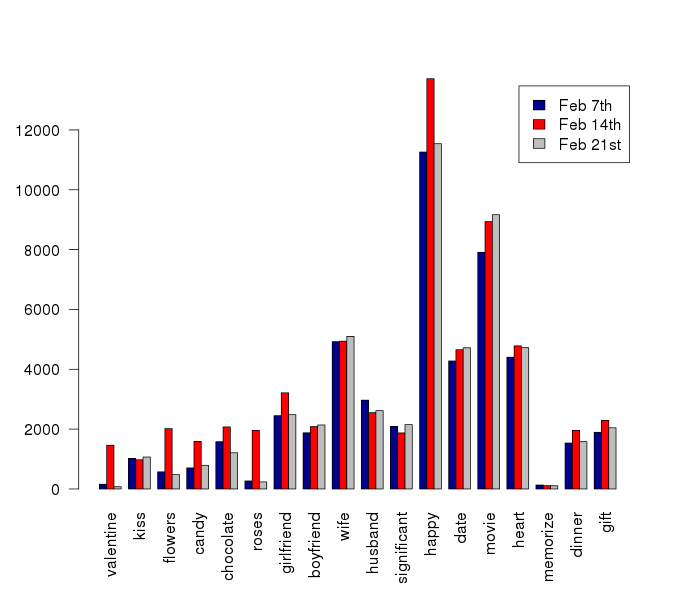

Homework 5 - Curious Cats (Team 3)
========================================================

# Task 1

The first task requires us to find out what is popular with redditors. In this respect, the goal is to classify the posted comments by the subreddit they belong to. In order to do this we use Hadoop to access the reddit data that has been made available to us. For this purpose, we have to define three functions: a mapper, a reducer, and a general function that uses those two for Hadoop. Our mapper extracts the subreddit to which any comment belongs and then our reducer sums the coccurences based on this characteristic.

```{r, echo = FALSE}
source("task1code.R")
load("task1.Rdata")
```
The map reduce job is executed by the code in the file `runTask1.R`.  This file is written to be used with the Makefile, as it first checks if the necessary data files already exist.  This is done because the map reduce jobs are time consuming and computationally expensive, so we want to avoid uncessary jobs.  The code in `task1code.R` takes the results of the map reduce job, which have been saved in `.Rdata` files, and produces the tables below.  We function `sortDF` takes a data frame, sorts by a specified column, and returns a specified number of rows.  The reasoning behind returning a specified number of rows is that we expect the top subreddits to be fairly stable.  This means that to get the change in position over time, we only need to consider, for instance, the top 200 subreddits in each month.  This improves the speed of the code by reducing the amount of data from 50,000 rows to 200.  As we verified that this was sufficient to collect all necessary information, nothing is lost by dropping these rows.  

The function `findRow` takes two data frame, a column, and a row.  It finds the row in the first data frame for which the specified column matches the value in the same column in the specified row of the second data frame.  For example, if the data frames were January and February, the column was 1 and the row was 4, it would find the row in the January data frame which corresponds to the value in the February data frame in the first column and the fourth row, which is `pics`. 
```{r}
findRow(clean.df$jan, clean.df$feb, 4, 1)
```

This shows that the `pics` subreddit moved from being the fifth most popular to being the fourth most popular.  The `makeDif` function uses the `findRow` function to add a column with the change in position between the months.  The `keep` argument specifies how many rows to retain.
```{r}
makeDif(clean.df$jan, clean.df$feb, 1, 5)
```

There is now a column called `pos.chg` in the data frame (we are using already processed data for simplicity).  The function `cleanDF` take a data frame and a column with the the change in position and cleans it for presentation.  The columns are given reasonable names and the integer is changed into a string with "+" or "-" indicating the direction of change.  The string "--" is used to indicate a subreddit that has the same rank as the previous month.  

The only point of subtlety is the possibility that a new subreddit will appear and be very popular.  This actually occurs in our data.  In April a subreddit called "thebutton" was created.  This subreddit did not exist in any previous month (we verified this with all data, not just the subset of 200 rows used to construct the tables below).  To catch such cases, we assigned any subreddit that was not found in the previous month a value of `Inf`.  This was done to ensure that a value was always returned by `findRow` and so that the value could easily be sorted out in `cleanDF`.  The value `Inf` was used instead of `NA` because `NA` values caused problems in the logical comparisons used for subsetting in `cleanDF`.  

The top subreddits are fairly stable.  The largest observed change was +115 (other than the creation of `thebutton`), which is relatively small compared to the 50,000 subreddits on Reddit.  The CollegeBasketball  subreddit increased 49 positions in March, which is when March Madness (the national playoff) happens.  Most other changes were fairly small.  
```{r, echo = FALSE}
clean.df$jan
clean.df$feb
clean.df$mar
clean.df$apr
clean.df$may
```

# Task 2

The second task requires us to find out at which times redditors post. The goal here is to find out both the weekday and the hour of the post. Similar to the first ask, we use Hadoop to access the reddit data. The difference to the first task primarily is in the form of our mapper. Instead of extracting the subreddit, we have to extract the time at which a post was made. The time is coded in the UTC format. Accordingly, we have to turn this encoded value into an hour or a weekday. In order to recode the value as weekday we use the lubridate package. The lubridate package allows us to plug a UTC value in and receive a weekday, either as numerical value or as character value.

Here we used a mapper collecting not only the hour and weekday, but also gilded variable. With a list being returned, we first turned it into a data frame, then provided heatmap on both ungilded data and gilded data
```{r}
load("task2.Rdata")
source("task2code.R")
```

Here are the heatmaps we get:


From the maps we can see that, it's quite straightforward that users will tend to comment more on weekend nights than weekday nights, and comment more on nights than days. Th most active hours are 7-11 p.m. and the most inactive hours are 1-8 a.m. However, For gilded users, they comment 1 hour earlier, and the distribution is more uniform at night, meaning that they are more stick with the website even on weekdays. But the main reason they are different is that there are many more ungilded users than gilded users. Gilded users are not representative.


# Task 3
In the third task we are required to compare what redditors said on the Valentines' Day of the year 2015 compared with other two control days. The two other days we picked were Feb 7th, 2015 and Feb 21st, 2015, in which case we would like to compare what happened on the Valentines' Day with the Saturdays before and after Valentines' Day. For this task we used Hadoop to access the reddit data of February. The reducer was the same `sum_reducer` we used in task 1 & 2. In the `word_count_map` function, we extracted the day the comment was posted using `$created_utc`, and extracted the body of the comment using `$body`.Then we split the comment into vector of words. The key was composed of each word and the day the comment was posted. The `rhcollect` function would send the key and value pairs for shuffling. Our `sum_reducer` sums the value of each unique key. 
```{r, echo = FALSE}
load("time.gzip")
```

For this specific task we brain stormed the 'hot word' that may highly related to the Valentines' Day:
```{r, echo = FALSE}
words.of.interest = c("valentine","kiss","flowers","candy","chocolate","roses",
  "girlfriend","boyfriend","wife",
  "husband","significant","happy",
  "date", "movie","heart","memorize","dinner","gift")
```
Basically we compared the frequencies of each word in each of the three days. The result can be easily shown and explained by a barplot as follows:



From the barplot we can see that, "valentine" "flowers" "chocolate" "roses" "happy" are more frequently used in redditors' comments, while the other words listed are used similarly often. Looks like redditors talked a lot about buying flowers, chocolates, roses on Valentines' Day. Among these words, "happy" was the most frequently used. 
